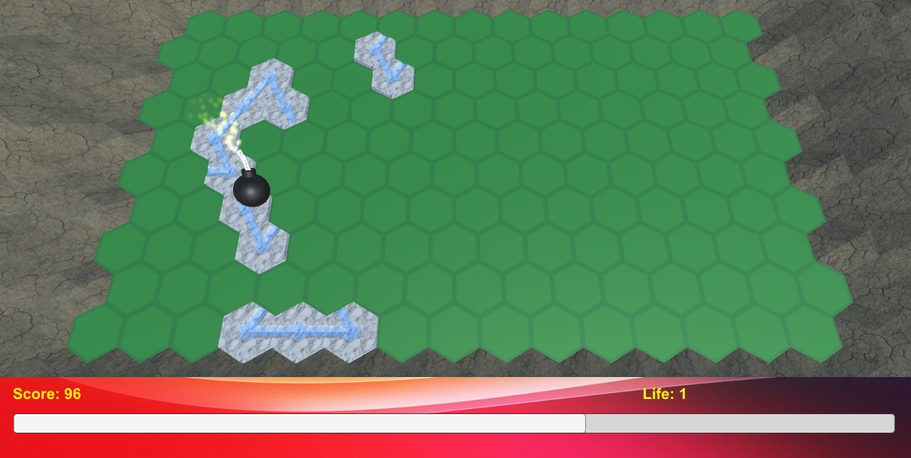
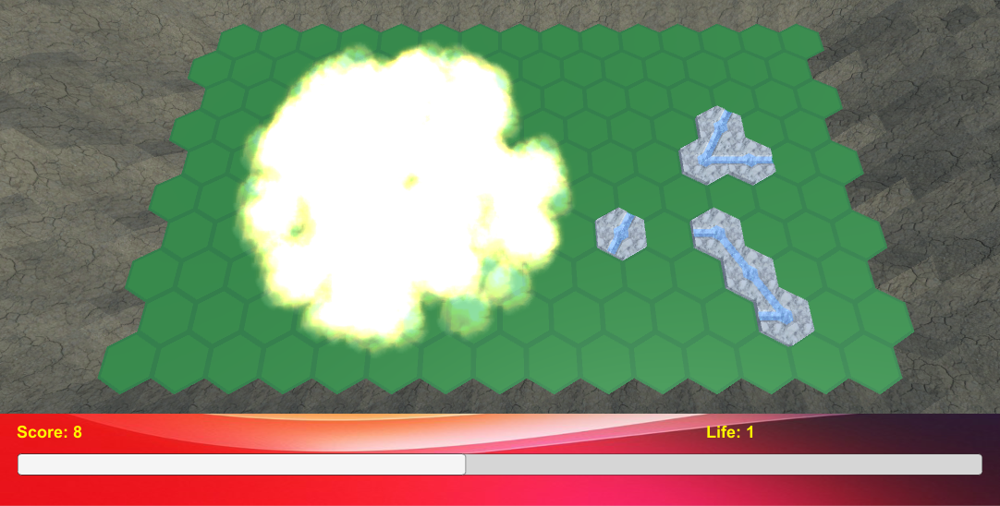
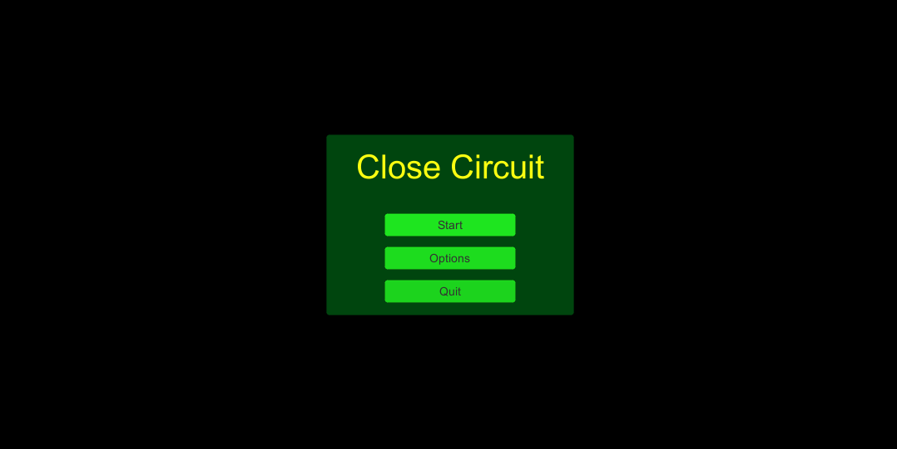
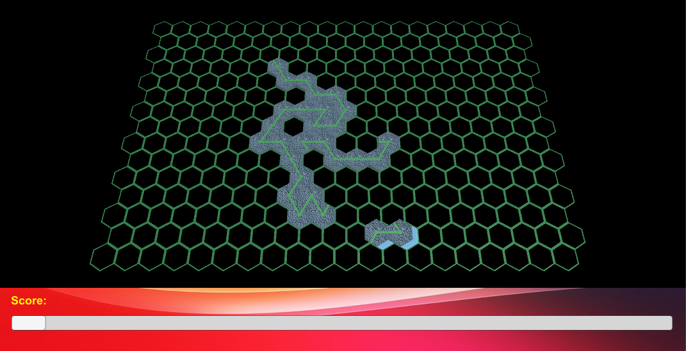
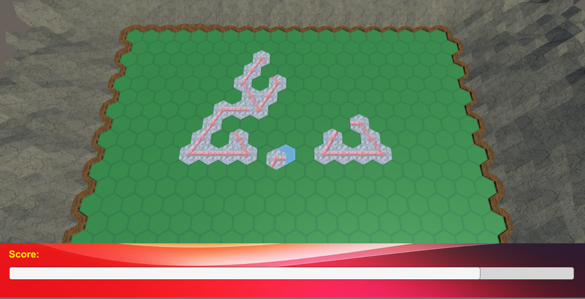
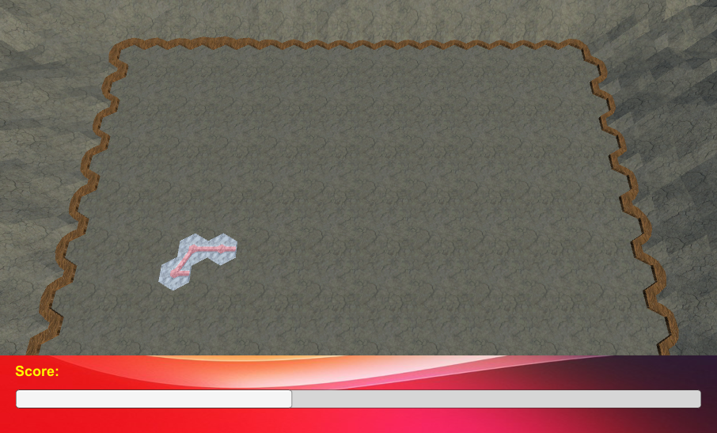

# HexCloseCircuit
The goal of this puzzle game is to create closed circuits from the randomly given pieces.

## Short term:

- music: Menu
- music: In Game
- music: Game Over - Highscore
- music: Game Over - No highscore
- music: Game Pause

## Long term:

- level
- better menu
- game modes
- coherent tasteful graphic style

## Snapshot:

2018-08-18: I've added the bomb

2018-08-18: EXPLOSION !

2018-08-15: The start menu, and yes, I need to work on it, it's ugly

2018-08-14: I'm trying to found a style... yes it look bad

2018-08-13

2018-08-12

